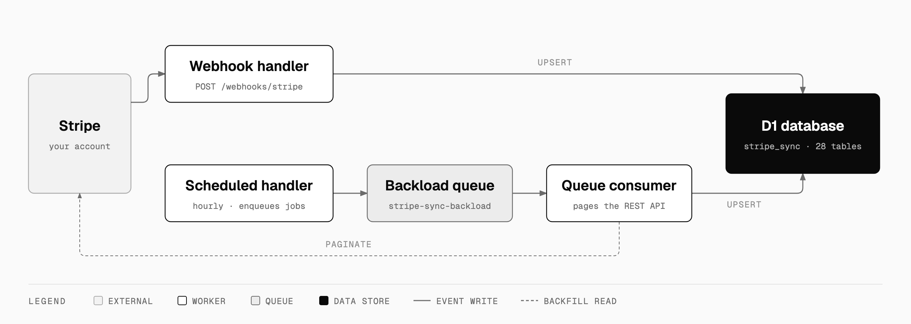
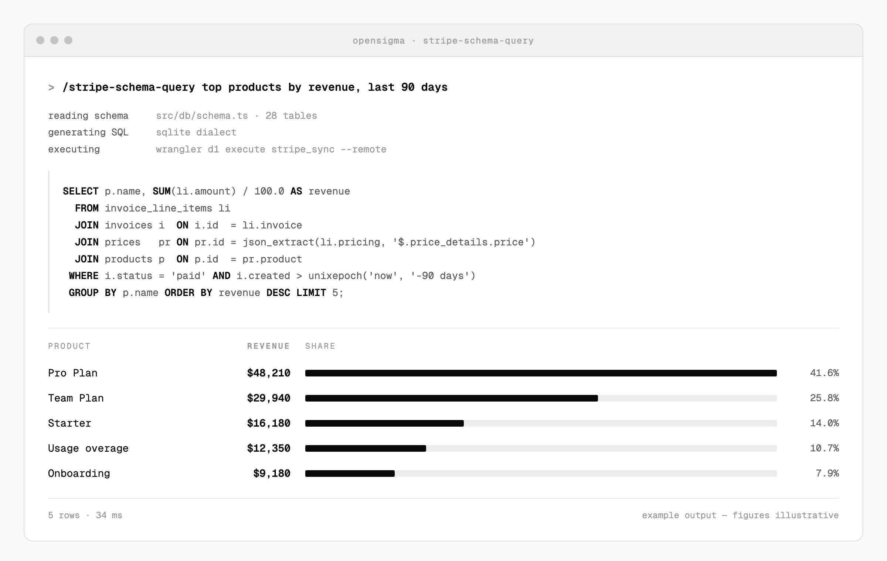
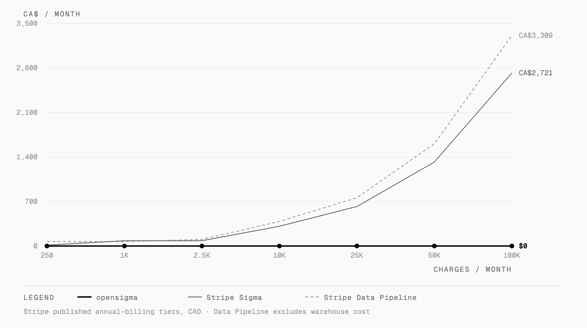

<div align="center">


# opensigma

### Your Stripe data, in your own database. Free, open source, no Sigma bill.

[](https://github.com/choyiny/opensigma/actions/workflows/ci.yml)
[](LICENSE)
[](https://workers.cloudflare.com/)
[](#whats-in-the-database)
[](#opensigma-vs-sigma-vs-data-pipeline)

</div>

<div align="center">
  <picture>
    <source media="(prefers-color-scheme: dark)" srcset="docs/assets/architecture-dark.png">
    
  </picture>
</div>

A free, open-source replacement for [Stripe Sigma](https://stripe.com/sigma) and [Stripe Data
Pipeline](https://stripe.com/data-pipeline). It mirrors your Stripe account into a Cloudflare D1
database so you can query it, join it against your own data, and build dashboards on top — without
paying Stripe a second time for data you already gave them.

It replicates the core behaviour of [stripe/sync-engine](https://github.com/stripe/sync-engine), but
runs entirely on Cloudflare Workers + D1 + Queues instead of Postgres and a long-lived server.

## What you get

- **Every billing-core object as a queryable SQLite row** — 25 synced Stripe resources, mirroring
  sync-engine's Postgres column set, ported to SQLite.
- **Webhook-driven freshness.** Rows update seconds after they change in Stripe. Out-of-order
  deliveries are dropped by a per-row `last_event_at` guard.
- **Historical backload**, paged from the Stripe REST API on an hourly cron, with a queue that
  retries anything webhooks missed.
- **Plain SQLite.** Query it with any SQLite client, any Worker, any BI tool. Join it against your
  own application tables.
- **Read-only by design.** The Stripe key it needs can't move money, refund anyone, or mutate your
  account — it can only read.
- **Free-tier friendly.** D1, Queues, and Workers cover most accounts at $0/mo.
- **Ask questions in plain English** with the bundled skill — and bring whichever model you like.

## Ask in English, get SQL

This repo ships a Claude Code skill at
[`.claude/skills/stripe-schema-query/`](.claude/skills/stripe-schema-query/SKILL.md). It reads the
Drizzle schema, writes the SQL, runs it through `wrangler`, and renders the result.

<div align="center">
  <picture>
    <source media="(prefers-color-scheme: dark)" srcset="docs/assets/query-dark.png">
    
  </picture>
</div>

```
/stripe-schema-query top 10 products by revenue last quarter
/stripe-schema-query MRR by month for the last year
/stripe-schema-query churn rate by plan, in-store vs online
```

The skill is just a prompt plus a workflow, so the model is your choice — Claude, GPT, Gemini, or
something local. It works with any agent that supports skills.

## opensigma vs Sigma vs Data Pipeline

<div align="center">
  <picture>
    <source media="(prefers-color-scheme: dark)" srcset="docs/assets/cost-dark.png">
    
  </picture>
</div>

| | **opensigma** | Stripe Sigma | Stripe Data Pipeline |
|---|---|---|---|
| **Price** | **$0** (Cloudflare free tier covers most accounts) | CA$14/mo (250 charges) → CA$621/mo (25k), then CA$0.028 per extra charge | CA$69/mo (1k charges) → CA$759/mo (25k), then CA$0.034 per extra charge — **plus** what you already pay for the warehouse |
| **Where the data lives** | Your D1 database (SQLite, you own it) | Stripe's servers — dashboard-only access | Snowflake / Redshift / Databricks / S3 / GCS / Azure (you provision and pay) |
| **Query interface** | Any SQLite client, any Worker, plus a natural-language skill that works with **any LLM** | Stripe's dashboard SQL editor + Stripe-managed AI | Whatever your warehouse supports |
| **Join with your own app data** | Yes — it's just SQLite, ship a Worker | No — Stripe data only | Yes, once it lands in your warehouse |
| **Freshness** | Seconds (webhook-driven) | Real-time (Stripe-side) | Batched, multi-hour latency |
| **Build apps & dashboards on top** | Yes — Workers bindings, any framework, any host | Limited — schedule reports, export, embed | Yes — whatever your warehouse supports |
| **Vendor lock-in** | None — MIT, runs on your Cloudflare account | Total — Stripe dashboard only | Partial — warehouse-portable but Stripe-gated |
| **Source code** | This repo, MIT-licensed | Closed | Closed |
| **Cost at 100k charges/mo** | **$0** | ~CA$2,721/mo | ~CA$3,309/mo + warehouse |

Sigma and Data Pipeline figures are computed from the annual-billing tiers published on Stripe's
[Sigma pricing](https://stripe.com/sigma/pricing) and
[Data Pipeline pricing](https://stripe.com/data-pipeline/pricing) pages (CAD, checked August 2026).
Monthly billing costs more — Sigma's 250-charge tier is CA$21/mo rather than CA$14. Both charge
overage per charge above the tier ceiling, which is what produces the curve above.

## Quick start

```bash
pnpm install

# wrangler.jsonc is gitignored — start from the example
cp wrangler.jsonc.example wrangler.jsonc

# Create the D1 database, then paste the printed database_id into wrangler.jsonc
wrangler d1 create stripe_sync

# Create the queues
wrangler queues create stripe-sync-backload
wrangler queues create stripe-sync-dlq

# Set secrets
wrangler secret put STRIPE_API_KEY        # the read-only restricted key, see below
wrangler secret put STRIPE_WEBHOOK_SECRET # from the Stripe webhook endpoint

# Apply migrations
pnpm db:migrate
```

Then point your Stripe webhook at `https://<your-worker-subdomain>/webhooks/stripe` and subscribe to
the event types listed in [`src/webhooks/dispatch.ts`](src/webhooks/dispatch.ts).

### The Stripe restricted API key

Create a **read-only restricted key** at
[dashboard.stripe.com/apikeys/create?name=opensigma](https://dashboard.stripe.com/apikeys/create?name=opensigma).

You want **Read** access on **every resource**, not just Billing Core — this project syncs charges,
payouts, balance transactions, disputes, checkout sessions, payment methods, radar, and more. The
fastest way:

1. Click **Select all permissions** at the top of the permissions list.
2. Switch the bulk selector from **None** → **Read**.
3. Scroll through and confirm everything is **Read** (leave **Write** unchecked).
4. Create the key and copy the `rk_live_…` (or `rk_test_…`) value.

A read-only key means a compromised Worker can't move money, refund anyone, or mutate your Stripe
account — it can only read.

## How the sync works

Two paths write to the same tables, as in the diagram above:

- **Webhooks** keep rows fresh in real time. Each row carries a `last_event_at` timestamp, so an
  out-of-order delivery is dropped rather than overwriting newer data.
- **Cron + queue** backfills history and re-heals anything webhooks missed. The hourly `scheduled()`
  handler enqueues a job per resource that isn't `done`; the consumer pages the Stripe REST API with
  the restricted key and upserts each page.
- **D1** is the only datastore. Query it from any Worker, or via `wrangler d1 execute`.

To force a full re-backload:

```bash
pnpm backload:reset
```

The next cron tick re-fetches from the start. Webhook-updated rows stay protected by `last_event_at`.

The whole thing is one Worker exporting `fetch`, `scheduled`, and `queue`:

```
src/
  index.ts      # the Worker export — fetch / scheduled / queue
  app.ts        # Hono app; the webhook route is the only public path
  env.ts        # bindings and job types
  stripe.ts     # Stripe client factory
  webhooks/     # signature verification (handler) + event→upsert mapping (dispatch)
  events/       # incremental event polling, and the shared event processor
  backload/     # scheduled() enqueue, queue consumer, resource registry
  upserts/      # one file per Stripe resource, each guarded by last_event_at
  db/           # Drizzle client + schema.ts (the 28 tables)
```

## What's in the database

28 tables in total — 25 synced Stripe resources plus 3 for bookkeeping.

**Bookkeeping** — `stripe_events`, `backload_state`, `backload_parent_progress`.

**Synced Stripe resources** — `customers`, `products`, `prices`, `subscriptions`,
`subscription_items`, `subscription_schedules`, `invoices`, `invoice_line_items`, `charges`,
`balance_transactions`, `payment_intents`, `payment_methods`, `setup_intents`, `refunds`, `disputes`,
`payouts`, `credit_notes`, `credit_note_line_items`, `checkout_sessions`,
`checkout_session_line_items`, `coupons`, `promotion_codes`, `tax_ids`, `reviews`,
`early_fraud_warnings`.

Schema lives in [`src/db/schema.ts`](src/db/schema.ts).

## Querying your data

It's an ordinary SQLite database:

```bash
wrangler d1 execute stripe_sync --command \
  "SELECT COUNT(*) FROM invoices WHERE status = 'paid' AND created > strftime('%s', '2026-01-01')"
```

Or wire it into a Worker, a dashboard, or the BI tool of your choice. Nothing here phones home to
Stripe for analytics — once the data is in D1, it's yours.

## Development

```bash
pnpm db:migrate:local
pnpm dev          # local Worker
pnpm test         # vitest-pool-workers — real D1 and Queues bindings
pnpm typecheck
```

Migrations are generated, never hand-written: edit `src/db/schema.ts`, then run `pnpm db:generate`.

## Built with

- [Cloudflare Workers](https://workers.cloudflare.com/), [D1](https://developers.cloudflare.com/d1/),
  and [Queues](https://developers.cloudflare.com/queues/)
- [Hono](https://hono.dev) for the webhook route
- [Drizzle ORM](https://orm.drizzle.team) + [drizzle-kit](https://orm.drizzle.team/kit-docs/overview)
  for the schema and migrations
- [stripe-node](https://github.com/stripe/stripe-node) for signature verification and REST paging
- [Vitest](https://vitest.dev) via
  [@cloudflare/vitest-pool-workers](https://developers.cloudflare.com/workers/testing/vitest-integration/) —
  tests run in `workerd` against real D1 and Queue bindings

Schema and column sets follow [stripe/sync-engine](https://github.com/stripe/sync-engine).

## Contributing

Issues and pull requests are welcome — see [CONTRIBUTING.md](CONTRIBUTING.md) for setup, the checks
CI runs, and the four touchpoints a new synced resource needs. By participating you agree to the
[Code of Conduct](CODE_OF_CONDUCT.md).

Found a security problem? Please follow [SECURITY.md](SECURITY.md) and report it privately rather
than opening an issue.

## Licence

MIT — see [LICENSE](LICENSE).

---

<div align="center">
<sub>Not affiliated with, endorsed by, or sponsored by Stripe. Stripe, Stripe Sigma, and Stripe Data
Pipeline are trademarks of Stripe, Inc. Pricing figures are from Stripe's public pricing pages and
may be out of date — check them yourself before making a decision.</sub>
</div>
